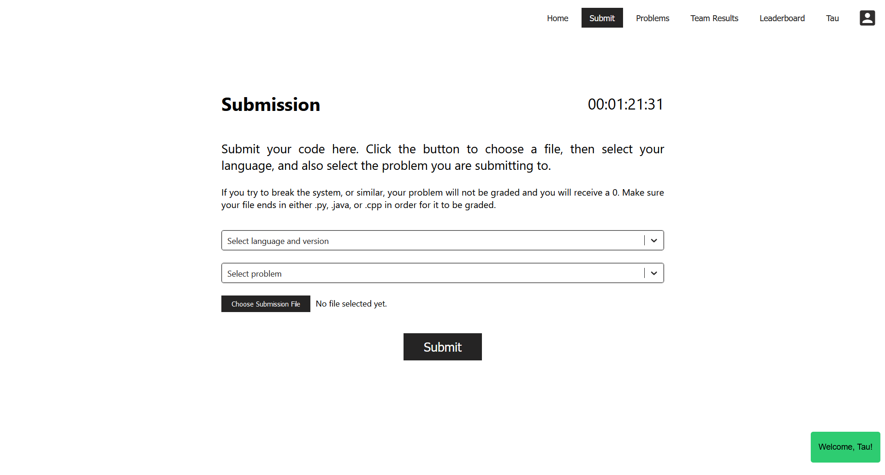

# TauGrad [](https://opensource.org/licenses/MIT) [](code_of_conduct.md)

> A Competitive Programming Grader System build with ReactJS and Fastify that allows for real-time submission and grading for small to mid scale competitions and events.



## Installation

To install, first clone the repo to your local computer and install dependencies. There are two NPM projects within the
repo, and there are dependencies for both that should be installed.

```bash
git clone https://github.com/azhangvo/TauGrad
cd ./TauGrad/website
npm i
cd ../grader
npm i
```

## Setup

### Website

Setting up the website is a matter of adjusting the text and styles to match the competition/event/goal that is being
run. Simply change the text to what is needed. The website is written in ReactJS, and the main text on the home page can be found within [Home.js](./website/src/Home.js).

### Grader

#### Configuration

Begin by creating the necessary directories and files. Example files are provided within the repository and can be used
as a template. If email notification is not needed (and will probably be phased out in the future), then remove all
relevant code relating to "transporter" and "nodemailer" from routes/submission-routes.js.

```bash
mkdir data
mkdir tests
cp email-example.json email.json
cp mongo-example.json mongo.json
cp token-example.json token.json
```

A MongoDB database and randomly generated token are required to store data and provide a JWT seed, respectively. The
database should authenticate using the admin database, and have a database named taugrad that the user has access to.
The taugrad database should have `regulation`, `teams`, and `users` collections. The `regulation` database should have
one document with `use: "restriction"` and `enabled: true`. The `teams` collection should, at the beginning, have one
document with `specificUse: "databaseInfo"` and `teamId: 0`. `teamId` will be incremented as more teams are created.
The `users` collection should, at the beginning, have `specificUse: "databaseInfo"` and `userId: 0`. As more users are
added, `userId` will be incremented.

#### Adding Problems

To add problems that users should be able to submit solutions to, first, update `regulation.json`. This file contains
two parameters, `problemAccess` and `problems`. The list of all prospective problems should be put in `problems` as
shown in the default. These problems will only be shown based on `problemAccess`.

`problemAccess` is a field that describes the range of problems that should be accessible. It is 1-indexed and inclusive
on both ends. The program will read `regulation.json` every few seconds and if a change is made to either of the fields,
behavior will be updated accordingly.

To add the test cases, create a folder for each problem in the `tests` folder. This name should exactly match what was
entered into `regulation.json` for the name of the problem. Provide the tests with the naming
convention `test{number}.in` for the input, and `test{number}.out` for the output, starting from `1`.

## Use

### Development

To run the program for development, run `npm start` in both folders. The grader will run on port 3001 and the website
will run on port 3000 and proxy requests to port 3001 by default.

### Production

First build the website with `npm build` within the website folder. This will generate a build folder, which should be
moved into the grader/static folder.

```bash
cp -r ./website/build ./grader/static/build
```

Then, running `npm start` in the grader directory will start the server on port 3001, which can then be accessed
directly through a web browser by going to `localhost:3001`. To host this publicly, using an Apache proxy is
recommended, with an example configuration below:

```
<VirtualHost *:80>
    ServerName your.website.here
    Redirect permanent / https://your.website.here
    ErrorLog ${APACHE_LOG_DIR}/blank-error_log
    CustomLog ${APACHE_LOG_DIR}/blank-access_log common
</VirtualHost>

<VirtualHost *:443>
    ServerName your.website.here
    SSLEngine on
    SSLCertificateFile /path/to/your/cert.pem
    SSLCertificateChainFile /path/to/your/fullchain.pem
    SSLCertificateKeyFile /path/to/your/privkey.pem
    ProxyPass / http://localhost:3001/ retry=0 connectiontimeout=50 timeout=600
    ProxyPassReverse / http://localhost:3001/ retry=0
    ProxyPreserveHost On
    ProxyTimeout 300
    SetEnv proxy-initial-not-pooled 1
    ErrorLog ${APACHE_LOG_DIR}/your.website.here
    CustomLog ${APACHE_LOG_DIR}/your.website.here common
</VirtualHost>
```

## License

[MIT](LICENSE.md) © 2021 Arthur Zhang